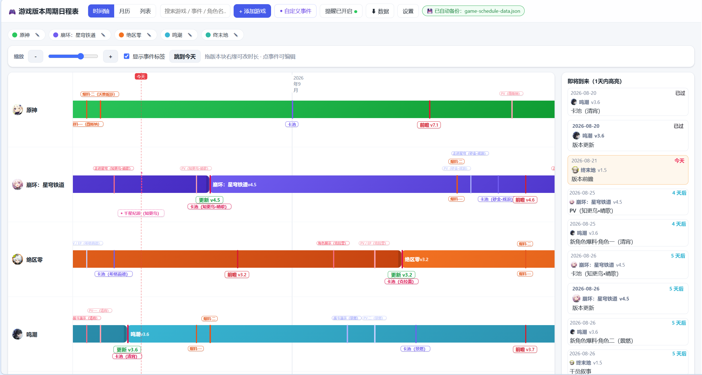
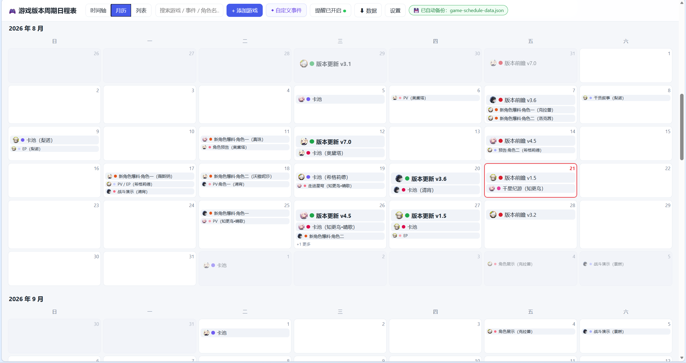

<div align="center">

# 🎮 游戏版本日程管理

**零依赖、纯前端的多游戏版本 / 卡池 / 活动日程看板**

[](https://jiuzhi1412.github.io/game-version-schedule/)
[](https://github.com/jiuzhi1412/game-version-schedule)

👉 **[在线体验 Live Demo](https://jiuzhi1412.github.io/game-version-schedule/)**

</div>

---

## 📸 界面预览

<div align="center">

| 时间轴视图 | 月历视图 |
| :--: | :--: |
|  |  |

</div>

---

## 🎮 支持的游戏

内置 **原神 / 崩坏：星穹铁道 / 绝区零 / 鸣潮 / 终末地** 五款，版本、卡池、角色节点由内置偏移规则自动推算，无需手动维护。

| 图标 | 游戏 | 主色 |
| :--: | :--- | :-- |
|  | **原神** | 🟢 |
|  | **崩坏：星穹铁道** | 🟣 |
|  | **绝区零** | 🟠 |
|  | **鸣潮** | 🔵 |
|  | **终末地** | 🟢 |

---

## 🗺️ 三种视图

- **列表**：按游戏分列，显示版本日期 / 持续天数 / 倒计时（按剩余天数自动分色）。
- **时间轴**：每款游戏一条轨道，版本 / 卡池 / PV 等节点以彩标落位，点击任意节点弹出详情卡片。
- **月历**：事件按重要程度排序，每格最多 3 个标签，多余事件鼠标悬停时展开。

> ⏳ 倒计时按「距今天数」分 5 档配色（今天 / 即将 / 中期 / 远期 / 过去），阈值与颜色均可在「设置 → 外观」中调整。

---

## ✨ 主要功能

- **➕ 自定义事件**：顶栏「◆ 自定义事件」可添加属于某游戏、带颜色与备注的私人节点，同步显示在时间与月历（不进列表）；点击标签同样弹出详情卡片。
- **🎨 外观个性化**：16 色板 + 取色器调整各档倒计时配色与阈值。
- **☁️ 云端同步**：基于 Supabase，多设备共用一份日程，时间戳「后写者胜」，支持「立即同步到云端」与退出时自动兜底推送。

## 🛠️ 其他

角色备注名（如「千星纪游（知更鸟）」）、快捷标签、列显隐 / 排序 / 改名、「恢复为默认数据」等细节功能，可在页面设置中按需使用。

---

## 🚀 本地运行

```bash
git clone https://github.com/jiuzhi1412/game-version-schedule.git
cd game-version-schedule
python -m http.server 8080   # 然后访问 http://localhost:8080
```

纯静态站点，也可直接双击 `index.html` 打开（会有无害的 CORS 提示）。

---

<p align="center">
Made with ❤️ for multi-game players · 纯前端 · 零依赖
</p>
